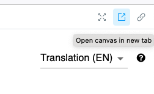

# editioncrafter
UNDER DEVELOPMENT: Software for the development of EditionCrafter, digital critical edition publication tool

## Storybook

For local development, you can use the Storybook component.

Setup for Storybook was kind of rushed and the process could still be made simpler.

1. Run `npm run build:css`. This will generate EditionCrafter's CSS and place it in the Storybook assets folder. At the moment, the CSS does not support live-refresh, even though the JS does.
2. Clone the [`edition-crafter-cli`](https://github.com/cu-mkp/editioncrafter-cli) repository if you haven't already, do the usual `npm install`, and run `npm start` to launch a server with a test document.
3. Back here in `editioncrafter`, run `npm run storybook` to launch Storybook. You'll see a component called EditionCrafter in the sidebar, and it should be all set to try.

By default, Storybook doesn't display the hash routing params used by `react-router`. You can use the "Open canvas in new tab" button on the top right to open the component in its own tab:

